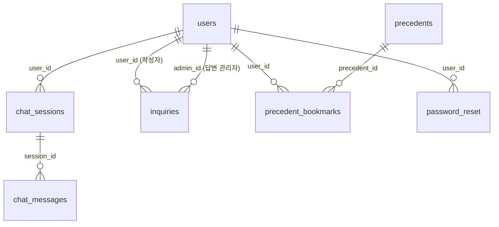

# DB 스키마

LawChat 서비스의 데이터베이스 스키마 정의입니다.

- `schema.sql` — 전체 테이블 생성 DDL (원본 소스, 실제 마이그레이션에 사용)
- `E-R Diagram.png` — ERD 캡처 이미지 (ERD 툴에서 내보낸 원본 스냅샷)
- 아래 Mermaid 다이어그램 — 테이블 간 관계 요약 (GitHub에서 마크다운만으로 자동 렌더링됨, 별도 이미지 없이 항상 최신 코드 기준으로 볼 수 있음)

## 테이블 관계도

> `chat_feedback_dataset.message_id`, `chat_messages.sources` / `chat_feedback_dataset.sources`는
> FK 제약조건 없이 참조용으로만 쓰이는 컬럼이라 위 관계도에는 포함하지 않았습니다.
> `notices`, `notice_popups`, `id_verifications`는 다른 테이블과 FK 관계가 없는 독립 테이블입니다.

## 테이블 개요

| 테이블 | 설명 |
|---|---|
| `users` | 사용자 계정 (일반/관리자, 소셜로그인 포함) |
| `chat_sessions` | 채팅 세션 (유저별 대화방) |
| `chat_messages` | 세션 내 개별 메시지 (user/ai) |
| `chat_feedback_dataset` | 챗봇 응답에 대한 피드백 수집용 |
| `precedents` | 판례 원문 데이터 |
| `precedent_bookmarks` | 유저별 판례 북마크 |
| `notices` | 게시판 형태 공지사항 |
| `notice_popups` | 메인 화면 팝업 공지 (이미지 기반) |
| `inquiries` | 1:1 문의 및 관리자 답변 |
| `id_verifications` | 회원가입 등 본인 인증 코드 |
| `password_reset` | 비밀번호 재설정 인증 코드 |

## ERD 원본 이미지

